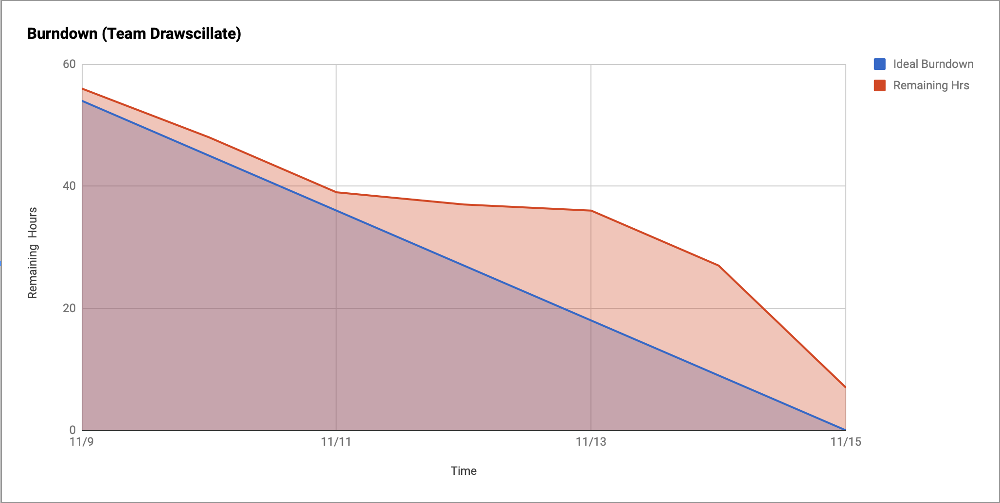

# Drawscillate

[User Story Video](https://youtu.be/8FFxvjQ4u8Q)

## Topic

Drawscillate, an interactive audio-visual game.

## Team 

[Andrew Selvia](https://github.com/AndrewSelvia) 
[Shraddha Nayak](https://github.com/shraddhanayak07) 
[Hetal Shah](https://github.com/ihetal) 
[Rajeev Sebastian](https://github.com/RajeevSebastian) 
[Aditya Agrawal](https://github.com/agrawaladit) 

## Abstract

People who tend to lose focus, Children who want to have fun, artists who want to explore, we have a one stop solution for you, **Drawscillate**. It is a virtual simulator to a classic Buzz Wire game.

## Scrum

[Sprint Task Sheet](https://docs.google.com/spreadsheets/d/1EVMsOQ3g3JuIVDFdPkGSJBxW_JH25RkZzY6yD2SRak4)

### Sprint Retrospectives

* [Sprint 1 Retrospective](https://youtu.be/xQuffx0hzCM)

### Daily Standup Recordings

* [11/18](https://youtu.be/TQFxYSvY6BM)
* [11/21](https://youtu.be/F1KQlH5aFno)

## Building & Running

We suggest building & running the app through through a general-purpose IDE (like IntelliJ IDEA). If you're using macOS, make sure to build & run with JDK 8; newer versions may fail according to [this source](https://discourse.processing.org/t/keep-getting-noclassdeffounderror-errors-on-mac/11727).
