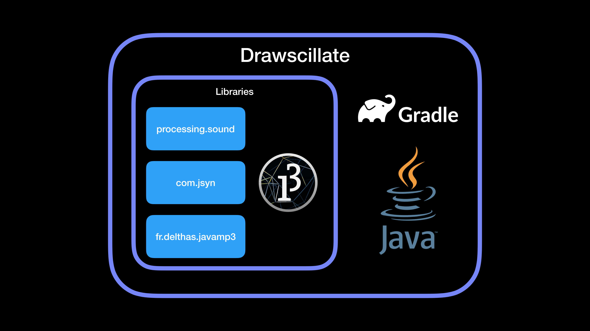
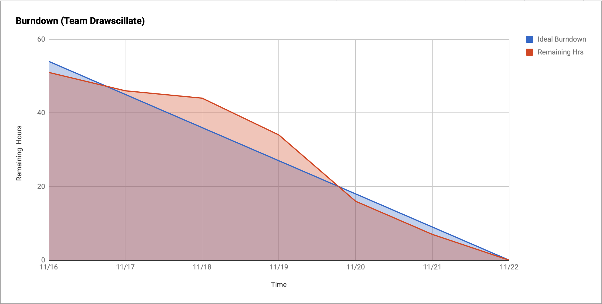

# Drawscillate

[User Story Video](https://youtu.be/8FFxvjQ4u8Q)

## Topic

Drawscillate: An interactive audio-visual game.

## Team 

* [Aditya Agrawal](https://github.com/agrawaladit)
* [Andrew Selvia](https://github.com/AndrewSelvia)
* [Hetal Shah](https://github.com/ihetal)
* [Rajeev Sebastian](https://github.com/RajeevSebastian)
* [Shraddha Nayak](https://github.com/shraddhanayak07)

## Summary

Drawscillate enables you to play with sound & color to express your creativity. Harking back to the classic Buzz Wire game, this modern interpretation demands your focus as you attempt to trace a simple shape (like a heart or a star). Along the way, use the keyboard to switch colors and play with the oscillating sounds that react to your movements. However you choose to play, we sincerely hope you have fun!

## Architecture Diagram

Drawscillate is built on the JDK 8 & Java 8 platform. It is built using Gradle 4.9. The libraries used include:
* processing.core: Enables presentation of basic GUI elements & mouse interactions
* processing.sound, com.jsyn, fr.delthas.javamp3: Enables the playback of the oscillating sounds from which Drawscillate derives its name

## Key Features

* Choose from 4 shapes: Star, Rectangle, Heart, Circle
* Choose from 3 difficulties: Easy, Normal, Hard
* Draw a line with your mouse
* Switch between 7 different colors while drawing: Black, Blue, Green, Orange, Purple, Red, Yellow
* Alter the oscillation of a background sound as you draw
* Trace within the boundaries of the shape from start to finish to win the game
* Share your finished artwork with the auto-generated picture of your completed drawing

## Contributions

### [Aditya Agrawal](https://github.com/agrawaladit)

* 

### [Andrew Selvia](https://github.com/AndrewSelvia)

#### Idea Generation

I experimented with various game ideas (Pac-Man, Sudoku, etc.) and tools (Greenfoot, Processing, etc.) until I found something original and achievable within a two-week timeframe. Then, I created our *Product Backlog* on GitHub with dozens of issues which allowed us to plan our sprints and stay focused on the most important tasks.

#### Scrum Master

One of the primary responsibilities of a scrum master is to remove impediments. The following contributions exemplify how I scouted ahead for our team to enable us to move with as much velocity as possible:
* Demonstrated the core [drawing](https://github.com/nguyensjsu/fa19-202-drawscillate/commit/3eeb721596dcbf29653d4d1ae4e11bc2eccf41fc) & [sound](https://github.com/nguyensjsu/fa19-202-drawscillate/commit/bed4f86bafa857d8a4e6261b7c5beb36b1bdceb9) APIs we would use to assemble our game
* Enabled us to [develop in IDEs other than Processing](https://github.com/nguyensjsu/fa19-202-drawscillate/commit/6b66e65cec595e057bc1e2d2cd49e947969db246) (i.e. Eclipse, IntelliJ IDEA), thereby leveraging skills we have built up in those environments and avoid the awkward ramifications of using Processing (i.e. .pde files rather than plain Java)
* Observed during our daily stand up meetings during Sprint 2 that we were all approaching a bottleneck of bad design (Drawscillate.java was a god class), so I bit the bullet to [deliver a well-designed refactoring into multiple screens](https://github.com/nguyensjsu/fa19-202-drawscillate/pull/62) so the team could keep making progress over the remaining few days of the sprint
* Added a [CI/CD pipeline with *spotbugs* & *smartsmells*](https://github.com/nguyensjsu/fa19-202-drawscillate/pull/97) to provide us insights into our code's quality during development

In addition, I coordinated daily stand up meetings, retrospectives, and contributed significantly to our [User Story Video](https://youtu.be/8FFxvjQ4u8Q).

### [Hetal Shah](https://github.com/ihetal)
As a member of this agile team, I worked rigorously on refactoring so that the code continues to be maintainable. In this process I tried to remove redundancies, eliminate unused functionalities and rejuvenate obsolete designs. The following contributions exemplifies this: 
* [Refactoring App Controller]( https://github.com/nguyensjsu/fa19-202-drawscillate/pull/48) 
* [Refactoring Options Screen]( https://github.com/nguyensjsu/fa19-202-drawscillate/pull/88) 
* [Refactoring Game Screen]( https://github.com/nguyensjsu/fa19-202-drawscillate/pull/80) 
* [Refactoring Game Logic]( https://github.com/nguyensjsu/fa19-202-drawscillate/pull/110)  

I also added and formatted the UI on the [options screen]( https://github.com/nguyensjsu/fa19-202-drawscillate/pull/76) to make the game feel more complete. 

Along with refactoring, I also implemented the following design patterns: Singleton, Observer, Composite.

### [Rajeev Sebastian](https://github.com/RajeevSebastian)

### [Shraddha Nayak](https://github.com/shraddhanayak07)

## Scrum

[Sprint Task Sheet](https://docs.google.com/spreadsheets/d/1EVMsOQ3g3JuIVDFdPkGSJBxW_JH25RkZzY6yD2SRak4)

### Sprints

We broke the project in to two one-week sprints so that we could at least make process improvements once during the project.

#### Sprint 1: 11/9-11/15

Our sprint goal was to attack the core problems, allowing ourselves leniency on quality temporarily. We aimed to have a proof-of-concept version of the game working as a deliverable. Each member pulled from the Sprint Backlog to assemble a list of achievable tasks. We did rough estimation, but found it difficult since everyone was very new to Processing. By the end of the sprint, we had a working prototype that we were able to include in our User Story Video.

A major process improvement opportunity we highlighted during our retrospective was to do a better job of accounting for dependencies during estimation. This arose because Rajeev volunteered for [a task](https://github.com/nguyensjsu/fa19-202-drawscillate/issues/5) which depended entirely on multiple other tasks. By the time they were finished, he only had a day or two left in the sprint and he was unable to hit the deadline. This was ultimately a result of poor planning. 

Another process issue we identified was that we were recording our effort incorrectly. Rather than subtracting the number of hours we worked on a task, so that the task *burned down*, we accumulated hours worked on a task. This made our burndown chart look like a saw blade rather than a decreasing incline. 

[Sprint 1 Retrospective Video](https://youtu.be/xQuffx0hzCM)

#### Sprint 2: 11/16-11/22

Learning from Sprint 1, we threw out some tasks: ([#9](https://github.com/nguyensjsu/fa19-202-drawscillate/issues/9), [#10](https://github.com/nguyensjsu/fa19-202-drawscillate/issues/10), [#12](https://github.com/nguyensjsu/fa19-202-drawscillate/issues/12)) we had planned to take on during Sprint 2 due to dependencies they had on other parts of the project. This focus allowed us to deliver on our core mission and maintain a stable backlog. We had one task ([#45](https://github.com/nguyensjsu/fa19-202-drawscillate/issues/45)) which we underestimated severely. It grew due to an accumulation of technical debt in the form of a god class. By the time we resolved to fix it, the task was large. In hindsight, we can see that we should have prioritized that work earlier to save us headaches down the road.

We also were intentional about having our daily standups at 10pm over Google Hangouts. The first sprint was a mixed bag of WhatsApp/Slack group messages that didn't achieve great participation. By sprint 2, we had hit our stride and resolved technical difficulties. Each stand up meeting lasted roughly 30 minutes. You can review a few of them below which we have uploaded to YouTube.

During our second retrospective, we highlighted our improvement at the planning stage that led to us completely burning down our tasks. We also are proud that we were able to include codesmells & spotbugs into the project via a CI/CD pipeline. If we had more time, we believe that would lead to higher quality releases.

* [Sprint 2 Retrospective Video](https://youtu.be/8kk5uiaEioI)

### Daily Stand Up Meeting Recordings

* [11/18](https://youtu.be/0-hVeGmCFGY)
* [11/21](https://youtu.be/F1KQlH5aFno)
* [11/22](https://youtu.be/G1VljefEL5I)

## Building & Running

We suggest building & running the app through through a general-purpose IDE (like IntelliJ IDEA). If you're using macOS, make sure to build & run with JDK 8; newer versions may fail according to [this source](https://discourse.processing.org/t/keep-getting-noclassdeffounderror-errors-on-mac/11727).
